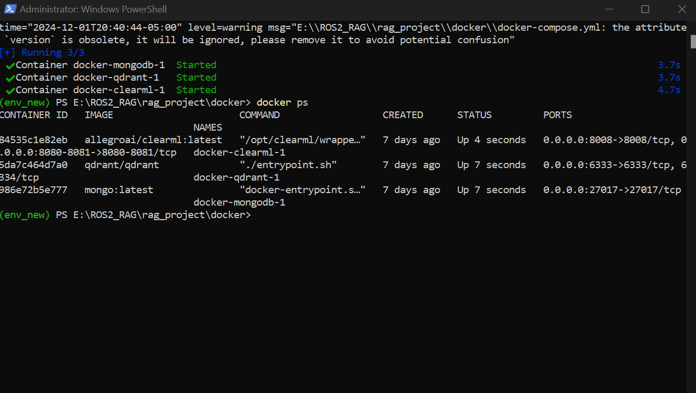

**#RAG (Retrieval Augmented Generation) for ROS2 (Robotic Operating System)**

##Overview:
Developed a RAG for ROS2. This RAG helps ROS2 developers for documentation and coding.

##Features:
- Knowledge Retrieval: Integration with a custom or pre-existing knowledge base to retrieve relevant documents or information.

- Generative AI: Utilizes a finetuned Llama 3.1 (8 B) model called `ros2_assistant` to provide coherent and context-sensitive responses.

##Project Structure:

#### ROS2_RAG
- env_new
- rag_project
    - docker
        - docker-compose.yml
    - src
        - __init__.py
        - database
            - mongo_client.py
            - qdrant_client.py
        - etl
            - __init__.py
            - data_processor.py
            - github_scraper.py
        - rag
            - __init__.py
            - generator.py
            - prompt_template.py
            - rag_pipeline.py
            - retriever.py
        - utils
            - text_processor.py
        - __init__.py
        - app.py
        - config.py
    - tests
        - __init__.py
        - evaluate_rag.py
        - test_pipeline.py
        - test_rag.py
    - .env
    - requirements.txt
- ros2_model                           # finetuned model saved here
- cleaned_training_data.json
- finetuning_llama3.1(8B).ipynb
- Readme.txt
- Modelfile

##Getting started:

###Prerequisites:
- 8 GB of RAM and 4 GB of GPU
- Git
- Python 3.10 or higher
- Docker
- MongoDB Compass
- Qdrant
- WSL2 (if windows)
- ClearML Authentication token
- Github Authentication token

###Installation:

1. Clone the repository

    `git clone <...>`\
    `cd <...>`

2. Activate virtual environment (Used Powershell in administration mode)

    `./env_new/Scripts/activate`

3. Install dependencies

    `pip install -r requirements.txt`

4. Compose docker files

    `cd docker`\
    `docker-compose up -d`\
    `cd ..`

5. Initialize data scraping pipeline

    `python -m tests.test_pipeline`

6. Start the gradio server

    `python -m src.app`

7. Go to local host http://127.0.0.1:7860/

8. Query the model.

##Github and Huggingface ID
- github: https://github.com/pranavpradhan007
- huggingface: https://huggingface.co/pranav211201

##Environment

(PS: If you can't render the image, open Docker.png)
(PS: Read Documentation.docx)

Pranav Tushar Pradhan
pp3051@nyu.edu
N18401944

Saavy Singh
ss19170@nyu.edu
N16140420
